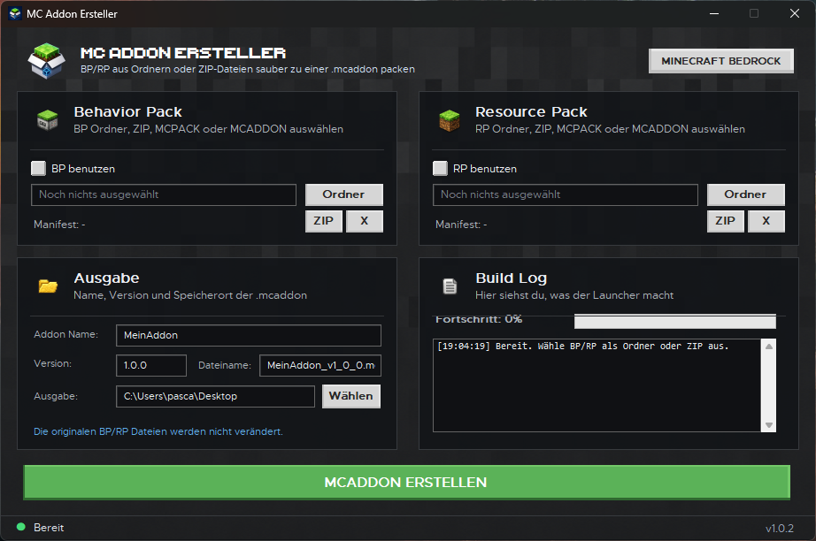

<div align="center">

# MC Addon Ersteller

[](https://github.com/xoxttxox/MC-Addon-Ersteller/releases/latest)
[](https://github.com/xoxttxox/MC-Addon-Ersteller/releases)
[](LICENSE)
[](https://dotnet.microsoft.com/)

Ein moderner Windows-Launcher zum Erstellen von Minecraft Bedrock Addons (`.mcaddon`) aus Behavior Packs (BP) und Resource Packs (RP).

</div>

**MC Addon Ersteller** ist ein kleiner, einfacher Windows-Launcher zum Erstellen von Minecraft Bedrock Addons im `.mcaddon` Format.



Du kannst ein **Behavior Pack (BP)**, ein **Resource Pack (RP)** oder beide zusammen auswählen. Der Launcher packt daraus automatisch eine saubere `.mcaddon` Datei mit Dateiname im Format `Name_v1_0_0.mcaddon`.

## Funktionen

- Erstellt `.mcaddon` Dateien aus Behavior Pack und/oder Resource Pack
- Unterstützt **nur BP**, **nur RP** oder **BP + RP**
- Unterstützt Ordner, `.zip`, `.mcpack` und `.mcaddon` als Quelle
- Liest `manifest.json` automatisch aus
- Erkennt Packs auch, wenn sie in einem extra Hauptordner liegen
- Automatischer Dateiname mit Name und Version
- Build Log mit einzelnen Schritten
- Fortschrittsanzeige im Fenster und in der Statusleiste
- Kleine feste Launcher-Größe
- Standard Windows-Fensterrahmen
- Keine Theme-Auswahl, kein Theme-System
- Dunkle Statusleiste
- Die Originaldateien werden nicht verändert

## Screenshots

Die Vorschau oben zeigt den geplanten Look und die GitHub-Dokumentation. Das Programm selbst ist bewusst klein und einfach gehalten.

## Unterstützte Eingaben

| Quelle | Unterstützt |
|---|---:|
| Behavior Pack Ordner | Ja |
| Resource Pack Ordner | Ja |
| `.zip` | Ja |
| `.mcpack` | Ja |
| `.mcaddon` | Ja |

## Ausgabe

Der Launcher erstellt automatisch eine Datei nach diesem Schema:

```txt
Name_v1_0_0.mcaddon
```

Beispiele:

```txt
MeinAddon_v1_0_0.mcaddon
CityTextures_v2_1_0.mcaddon
```

## Voraussetzungen für Entwickler

Zum Bearbeiten oder Bauen aus dem Source brauchst du:

- Windows 10 oder Windows 11
- Visual Studio mit **.NET Desktop Development**
- .NET 10 SDK

Projekt-Target:

```txt
net10.0-windows
```

## Projekt öffnen

In Visual Studio:

```txt
MCAddonErsteller.sln
```

Oder direkt das Projekt:

```txt
src\MCAddonErsteller\MCAddonErsteller.csproj
```

## Normales Build

```bat
build\build-release.bat
```

Oder direkt:

```bat
dotnet build src\MCAddonErsteller\MCAddonErsteller.csproj -c Release
```

## Release Build als einzelne EXE

Empfohlen für Veröffentlichung auf GitHub Releases:

```bat
build\publish-win-x64.bat
```

Danach liegt die fertige Datei hier:

```txt
release\MCAddonErsteller.exe
```

Die EXE wird als **self-contained single file** gebaut. Dadurch braucht der Nutzer normalerweise keine extra .NET Runtime zu installieren.

## PowerShell Build

Alternativ:

```powershell
.\build\publish-win-x64.ps1
```

## GitHub Release veröffentlichen

1. Projekt auf GitHub hochladen
2. Lokal ausführen:

```bat
build\publish-win-x64.bat
```

3. Auf GitHub unter **Releases** eine neue Version erstellen
4. Diese Datei hochladen:

```txt
release\MC Addon Ersteller.exe
```

Optional kannst du zusätzlich den Source als ZIP hochladen.

## Projektstruktur

```txt
MC-Addon-Ersteller/
├─ .github/
│  └─ workflows/
│     └─ build.yml
├─ assets/
│  ├─ app.ico
│  └─ app_icon.png
├─ build/
│  ├─ build-release.bat
│  ├─ publish-win-x64.bat
│  └─ publish-win-x64.ps1
├─ docs/
│  └─ preview.png
├─ src/
│  └─ MCAddonErsteller/
│     ├─ Models/
│     ├─ Services/
│     ├─ MainForm.cs
│     ├─ Program.cs
│     ├─ app.manifest
│     └─ MCAddonErsteller.csproj
├─ .gitignore
├─ LICENSE
├─ MCAddonErsteller.sln
└─ README.md
```

## Hinweise

- `.mcaddon` ist technisch eine ZIP-Datei mit anderer Endung.
- BP/RP müssen eine gültige `manifest.json` enthalten.
- Wenn du nur ein BP auswählst, wird auch nur dieses BP in die `.mcaddon` gepackt.
- Wenn du nur ein RP auswählst, wird auch nur dieses RP in die `.mcaddon` gepackt.
- Wenn du BP und RP auswählst, werden beide gemeinsam in eine `.mcaddon` gepackt.

## Lizenz

Dieses Projekt steht unter der MIT-Lizenz. Siehe [LICENSE](LICENSE).